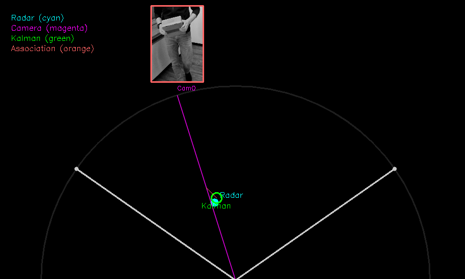
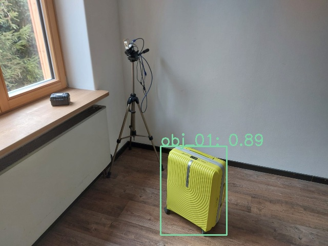
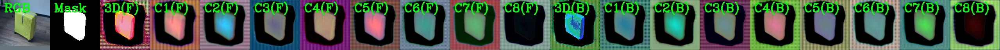
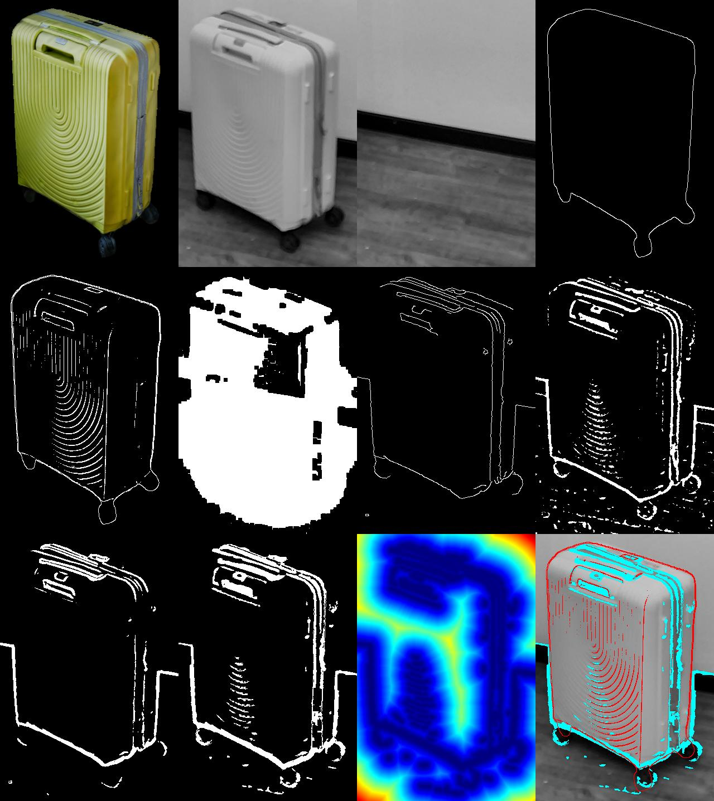

# CARRASS

**Camera and Radar Robotic Arm Safety System**

> 🚨 **RESEARCH PROOF OF CONCEPT**
>
> This is a **WIP research PoC** with experimental code and incomplete integrations.  
> Do not expect working code or documentation. No guarantees are made regarding correctness, robustness, real-time behavior, or safety compliance.


## Dev Setup

1. Download recorded session data from [here](https://tum.fredhennecke.com/x/57e09ad469fab426/82276a69ad7dec5e.zip)

2. Extract the zip file into `recordings`

3. Either just replay a recorded session:
    ```
    python -m utils.capture_replay_visualize --mode play --name session_person
    ```
    or run the main system with a recorded session as input: 
    ```
    python main.py --mode play --name session_person --verbose
    ```
   
## Components


| Component                       | Function                                                                                                                                                                                                                                                                                                                                                                                                                                                                                                                                                                                                      | Visualization                                    |
|:--------------------------------|:--------------------------------------------------------------------------------------------------------------------------------------------------------------------------------------------------------------------------------------------------------------------------------------------------------------------------------------------------------------------------------------------------------------------------------------------------------------------------------------------------------------------------------------------------------------------------------------------------------------|:------------------------------------------------|
| **Kalman Filter**               | Performs **sensor fusion** to provide optimal state estimates by filtering out noise from multiple data sources.                                                                                                                                                                                                                                                                                                                                                                                                                                                                                              |         |
| **Classification**              | Classifies potential robots using a **YOLOv11** model. The model was trained on synthetic data. Trained model weights are available [here](https://tum.fredhennecke.com/x/57e09ad469fab426/6eb84bfacdf75e16.zip).                                                                                                                                                                                                                                                                                                                                                                                             |           |
| **6-DOF Pose Estimation**       | Estimates the full **6-DOF pose** based on the **[HCCEPose](https://github.com/WangYuLin-SEU/HCCEPose)** framework ([Paper](https://arxiv.org/abs/2510.10177)). Training and inference were executed on sample data in a cloud environment. Due to time constraints and integration challenges, inference logic was not integrated into the processing pipeline. However, intermediate representations can be stored to enable straightforward evaluation in the cloud environment. Trained model weights are available [here](https://tum.fredhennecke.com/x/57e09ad469fab426/6eb84bfacdf75e16.zip). |     |
| **Safe Algorithmic Validation** | Provides a sample **6-DOF pose estimate** and corresponding model rendering in `safety_cage_validate_src`, enabling systematic testing and validation of the proposed safety logic.                                                                                                                                                                                                                                                                                                                                                                                                                           |  |

## 3D Model Assets

The 3D model of our sample robot (carry-on suitcase) was captured using the KIRI Engine. Model files with textures are available [here](https://tum.fredhennecke.com/x/57e09ad469fab426/f06f7521f2f6b337.zip).


## Acknowledgements

This project builds upon the **HCCEPose** framework by Wang et al. We thank the authors for making their code and publication publicly available, which enabled rapid experimentation and evaluation in this work.


